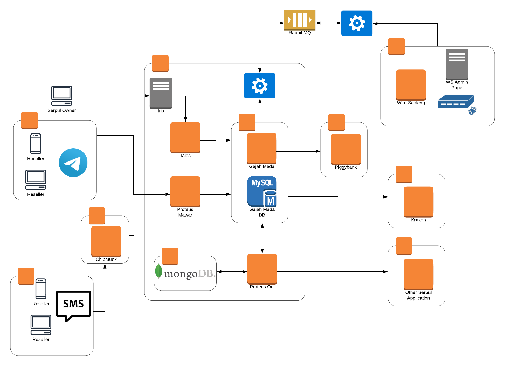

= Architecture Proteus Mawar

Berikut ini merupakan _High Level Architecture_ dari Proteus Mawar :

. Proteus Mawar menangani transaksi dari Channel Telegram dan Channel SMS melalui sistem Chipmunk.
. Proteus Mawar meneruskan _request_ transaksi ke GM, untuk dicatat transaksi di DB GM.
. Talos _connect_ ke GM untuk _setting_ agar bisa sesuai dengan konfigurasi Proteus, dan ditampilkan di Iris.
. GM mengambil stok dari Proteus Out yang mengarahkan ke beberapa Serpul Lain, seperti IRS, Otomax, Tiger, dan lain-lain.
. GM juga bisa mengambil stok langsung ke Kraken, atau ke Wiro Sableng (biller yang kita punya) sebagai penyedia stok produk, dan bisa diatur di WS _admin page_.
